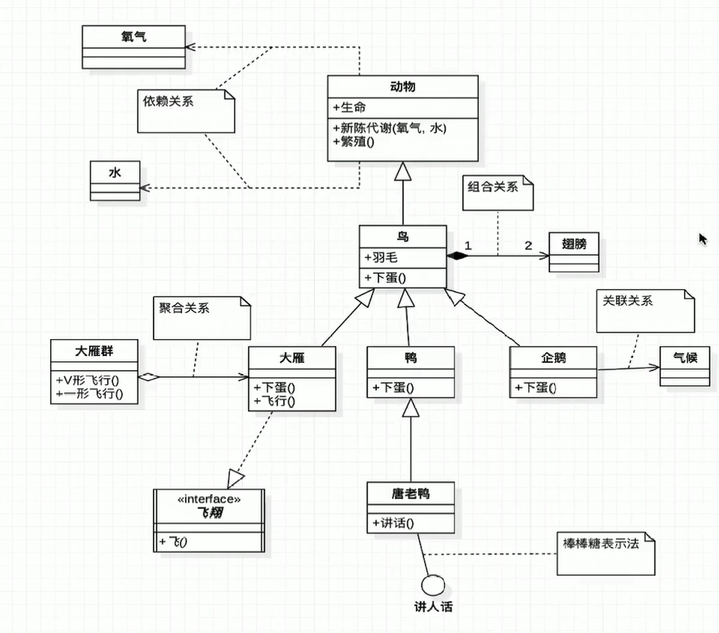

## UML
Unified Modeing Language 统一建模语言

### 依赖 & 关联
方向：我需要XXX，那么我嘚知道XXX，所以指向XXX
 - 依赖关系【虚线】较弱的关系，一般用来做传参或返回值
 - 关联关系【实线】较强的关系，一般为类中的一个属性

### 聚合 & 组合
方向：菱形就是一个盘子，一个器皿。所以是大的指向少的。
 - 聚合【空心菱形】（弱依赖）两者生命周期不一致
 - 组合【实心菱形】（强依赖）两者生命周期一致

### 继承 & 实现
方向：子类一定知道父类，所以子指向父
 - 继承父类【实线】类和类，继承是很明确的
 - 实现接口【虚线】虚即代表接口没有实体

### 泛化 / 继承（Generalization）

在上图中，空心的三角表示继承关系（类继承），在UML的术语中，这种关系被称为泛化（Generalization）。Person(人)是基类，Teacher(教师)、Student(学生)、Guest(来宾)是子类。

若在逻辑上B是A的“一种”，并且A的所有功能和属性对B而言都有意义，则允许B继承A的功能和属性。

如果A是基类，B是A的派生类，那么B将继承A的数据和函数。 
如果类A和类B毫不相关，不可以为了使B的功能更多些而让B继承A的功能和属性。
若在逻辑上B是A的“一种”（a kind of ），则允许B继承A的功能和属性。

### 组合

**菱形为实心的**，它代表了一种更为坚固的关系——组合（composition）（聚合类型为复合）。组合表示的关系也是has-a，不过在这里，A的生命期受B控制。即A会随着B的创建而创建，随B的消亡而消亡。

例如，眼（Eye）、鼻（Nose）、口（Mouth）、耳（Ear）是头（Head）的一部分，所以类Head应该由类Eye、Nose、Mouth、Ear组合而成，不是派生（继承）而成。 

### 聚合

上面图中，有一个**菱形（空心）**表示聚合（aggregation）（聚合类型为共享），聚合的意义表示has-a关系。聚合是一种相对松散的关系，聚合类B不需要对被聚合的类A负责。

相当于一个团伙，几个人合在一起可以做成一件事，这件事做完后大家分散开来各自都还存在，各自再做各自的事，他们的生命周期不相关。

### 依赖

这里B与A的关系只是一种依赖(Dependency)关系，这种关系表明，如果类A被修改，那么类B会受到影响。