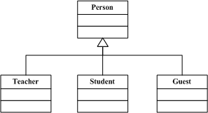
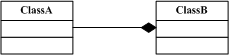
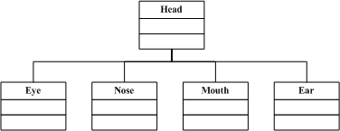
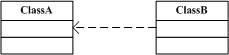

# 面向对象

 - 函数式（结构化）
   - 顺序、判断、循环
 - 面向对象（数据结构化）
 - 对于计算机，结构化的才是最简单的
 - 编程应该： 简单 & 抽象

### 类
类，就是一个模板，可以通过它构造出很多对象。 类里面通常包含一些属性和方法。

### 对象
类的一个实例，一个实体，它拥有类的所有属性和方法，他与其他对象。

## 面向对象三要素

### 封装
 封装就是事物抽象为类，把对外接口暴露，将实现和内部数据隐藏，做到权限和保密。

### 继承
面向对象编程 (OOP) 语言的一个主要功能就是“继承”。继承是指这样一种能力：它可以使用现有类的所有功能，并在无需重新编写原来的类的情况下对这些功能进行扩展。

通过继承创建的新类称为“子类”或“派生类”。
被继承的类称为“基类”、“父类”或“超类”。
继承的过程，就是从一般到特殊的过程。
要实现继承，可以通过“继承”（Inheritance）和“组合”（Composition）来实现。
在某些 OOP 语言中，一个子类可以继承多个基类。但是一般情况下，一个子类只能有一个基类，要实现多重继承，可以通过多级继承来实现。
 
继承概念的实现方式有三类：实现继承、接口继承和可视继承。
 - 实现继承是指使用基类的属性和方法而无需额外编码的能力；
 - 接口继承是指仅使用属性和方法的名称、但是子类必须提供实现的能力；
 - 可视继承是指子窗体（类）使用基窗体（类）的外观和实现代码的能力。


在考虑使用继承时，有一点需要注意，那就是两个类之间的关系应该是“属于”关系。例如，Employee 是一个人，Manager 也是一个人，因此这两个类都可以继承 Person 类。但是 Leg 类却不能继承 Person 类，因为腿并不是一个人。

抽象类仅定义将由子类创建的一般属性和方法，创建抽象类时，请使用关键字 Interface 而不是 Class。

OO开发范式大致为：
```
划分对象  →  抽象类  →  将类组织成为层次化结构(继承和合成)  →  用类与实例进行设计和实现几个阶段。
```

### 多态

多态性（polymorphisn）是允许你将父对象设置成为和一个或更多的他的子对象相等的技术，赋值之后，父对象就可以根据当前赋值给它的子对象的特性以不同的方式运作。简单的说，同一接口不同实现。

实现多态，有二种方式，覆盖，重载。

 - 覆盖，是指子类重新定义父类的虚函数的做法。
 - 重载，是指允许存在多个同名函数，而这些函数的参数表不同（或许参数个数不同，或许参数类型不同，或许两者都不同）。

其实，重载的概念并不属于“面向对象编程”，重载的实现是：编译器根据函数不同的参数表，对同名函数的名称做修饰，然后这些同名函数就成了不同的函数（至少对于编译器来说是这样的）。

如，有两个同名函数：function func(p:integer):integer;和function func(p:string):integer;。

那么编译器做过修饰后的函数名称可能是这样的：int_func、str_func。对于这两个函数的调用，在编译器间就已经确定了，是静态的（记住：是静态）。也就是说，它们的地址在编译期就绑定了（早绑定），因此，重载和多态无关！真正和多态相关的是“覆盖”。当子类重新定义了父类的虚函数后，父类指针根据赋给它的不同的子类指针，动态（记住：是动态！）的调用属于子类的该函数，这样的函数调用在编译期间是无法确定的（调用的子类的虚函数的地址无法给出）。因此，这样的函数地址是在运行期绑定的（晚邦定）。结论就是：重载只是一种语言特性，与多态无关，与面向对象也无关！引用一句Bruce Eckel的话：“不要犯傻，如果它不是晚邦定，它就不是多态。”

那么，多态的作用是什么呢？我们知道，封装可以隐藏实现细节，使得代码模块化；继承可以扩展已存在的代码模块（类）；它们的目的都是为了——代码重用。而多态则是为了实现另一个目的——接口重用！多态的作用，就是为了类在继承和派生的时候，保证使用“家谱”中任一类的实例的某一属性时的正确调用。

## UML
Unified Modeing Language 统一建模语言

### 泛化 / 继承（Generalization）


在上图中，空心的三角表示继承关系（类继承），在UML的术语中，这种关系被称为泛化（Generalization）。Person(人)是基类，Teacher(教师)、Student(学生)、Guest(来宾)是子类。

若在逻辑上B是A的“一种”，并且A的所有功能和属性对B而言都有意义，则允许B继承A的功能和属性。

如果A是基类，B是A的派生类，那么B将继承A的数据和函数。 
如果类A和类B毫不相关，不可以为了使B的功能更多些而让B继承A的功能和属性。
若在逻辑上B是A的“一种”（a kind of ），则允许B继承A的功能和属性。


### 组合



**菱形为实心的**，它代表了一种更为坚固的关系——组合（composition）（聚合类型为复合）。组合表示的关系也是has-a，不过在这里，A的生命期受B控制。即A会随着B的创建而创建，随B的消亡而消亡。



例如，眼（Eye）、鼻（Nose）、口（Mouth）、耳（Ear）是头（Head）的一部分，所以类Head应该由类Eye、Nose、Mouth、Ear组合而成，不是派生（继承）而成。 


### 聚合


上面图中，有一个**菱形（空心）**表示聚合（aggregation）（聚合类型为共享），聚合的意义表示has-a关系。聚合是一种相对松散的关系，聚合类B不需要对被聚合的类A负责。

相当于一个团伙，几个人合在一起可以做成一件事，这件事做完后大家分散开来各自都还存在，各自再做各自的事，他们的生命周期不相关。


### 依赖


这里B与A的关系只是一种依赖(Dependency)关系，这种关系表明，如果类A被修改，那么类B会受到影响。